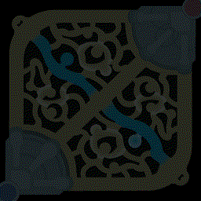
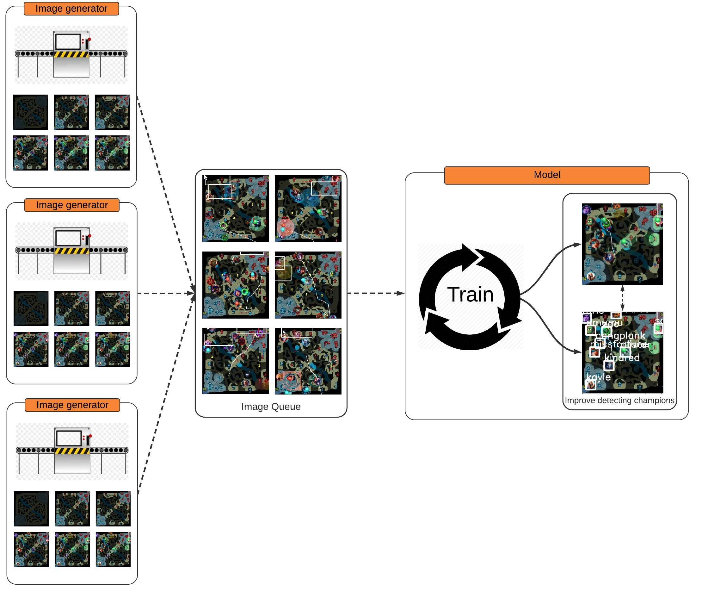

# LeagueMinimapDetectionCNN

[Source code to my blog post](https://maknee.github.io/blog/2021/League-ML-Minimap-Detection2/)


# Setup

Windows:
```python
python3 -m venv env
env\Scripts\activate
pip install -r requirements.txt
```

Linux/Mac
```python
python3 -m venv env
source env/Scripts/activate
pip install -r requirements.txt
```

# Reproducing blog material

## Running to generate image layers
- Run `show_generated_image_layers.ipynb` in a python notebook

- This will generate a file `layered_minimap.gif` and produce timing results for generation and training



## Evaluation

- Contains the evaluation code in the blog

- Go to `evaluation` folder and follow the `README.md` folder to view results from the blog post/reproduce results.

## Model

- Model trained for 8 hours is in `trained_models\fastrcnn_model_8hrs.pt`

# Training

## League version

- Assumes patch is 10.7 -- that there were 149 champions in this patch

## Updates (optional)

- Update the folders in `league_icons` to match the current version

- Most likely you need to updated the number of champions (add the missing champion icons under `league_icons/champion`)

## Running

- Run `train.ipynb` as a python notebook

- *Or*

- [Run with colab](https://colab.research.google.com/drive/1MU4THM9_XgaexP0wehxpRnpTZJYWk0Yz?resourcekey=0-thRVsBmg0Gqz6tVy1lHZHA#offline=true&sandboxMode=true)

### Architecture

- Runs multiple threads to generate data that is forwarded to the model to train on



# Production

## Run ingame

- This will load the already trained model shown in the blog post. Change the path to your trained model if desired.

- `python pytorch_test_ingame.py trained_models\fastrcnn_model_8hrs.pt 149`

- *Only tested with the game set as borderless and with a 1920x1080 resolution*

- This will run with external window displaying the detected champions like this


## Run ingame with gif output

- Outputs `test.gif` that runs for 1000 frames, which is shown above

`python pytorch_test_ingame.py trained_models\fastrcnn_model_8hrs.pt 149 test.gif`


